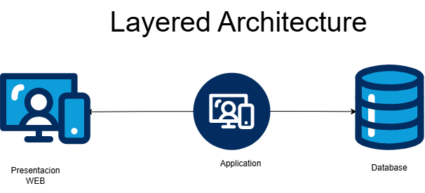

# 📌 HospitApp

HospitApp is a **web-based platform** designed to **optimize access to healthcare services** in Antioquia. It provides **fast and accurate** information about hospitals and clinics, integrating advanced features to enhance the user experience and ensure an **efficient arrival** at the right medical facility.

---

## 📖 Table of Contents  
- [Problem Statement](#problem-statement)  
- [Solution: HospitApp](#solution-hospitapp)  
  - [Features & Functionalities](#features--functionalities)  
- [Impact of HospitApp](#impact-of-hospitapp)  
- [Team Members](#team-members)  
- [Tech Stack](#tech-stack)  
- [Getting Started](#getting-started)  
  - [Installation](#installation)  
---

## Problem Statement  

In Antioquia, accessing healthcare services **efficiently and quickly** is a challenge for many people, especially:
- Those facing **emergencies**.
- Individuals unfamiliar with the **healthcare system**.
- Patients with **specific insurance coverage** restrictions.
- **Travelers and international students** looking for hospitals that accept their insurance.

The **lack of integration** with navigation tools makes reaching medical centers **slower and more complex**, leading to:
- **Delays in medical attention**.
- **Uncertainty** about which hospitals accept specific insurance plans.
- **Barriers to equitable access** to healthcare.

---

## Solution: HospitApp  

HospitApp offers **a smart, user-friendly, and real-time solution** that allows users to **quickly locate** the most suitable hospitals and navigate to them effortlessly.

### Features & Functionalities  

✔ **Smart Hospital Search**  
- Filter by **medical specialization** to find the right facility based on health needs.  
- View **ratings and reviews** from previous patients.  
- Check **EPS and Insurance coverage** to know which hospitals accept specific insurance plans.

✔ **Navigation System Integration**  
- **Google Maps & Waze** redirection for fast and safe navigation.  
- **Real-time data** on distance and estimated arrival time.

✔ **User System & Reviews**  
- User accounts to **rate and review hospitals**.  
- Continuous improvement through user feedback.

✔ **Search Prioritization System**  
- **Sponsored hospitals** can appear with priority in search results.  
- Sort results by **rating, proximity, or sponsored priority**.

---

## Impact of HospitApp  

HospitApp ensures **faster and more informed medical access** by helping users:
- **Identify** the right healthcare provider.  
- **Navigate efficiently** to medical facilities.  
- **Reduce waiting times** and access **better healthcare services**.  

🚀 **HospitApp: The fastest, safest, and smartest way to find medical care in Antioquia.**  

---


## Scope  

We define the scope of HospitApp as the set of functionalities that the application is expected to have. Below are the expected features of the application:  

1. *User Registration**: The application will allow users to register. To do this, the user will be asked for their first name, last name, email, and password.  
2. *Login*: The application will allow users to log in. Users will be required to enter their email and password. Additionally, administrators will be able to log in with their credentials.  
3. *Search with Filters for Specialty, Health Insurance, Range, and Sorting by Proximity, Rating, and Promotions*: Users will be able to search for hospitals and clinics based on specialty, health insurance provider, distance range, and sort results by proximity, rating, and promotions.  
4. *Redirection to Google Maps or Waze*: Users will be able to redirect to Google Maps or Waze to get directions to the selected hospital or clinic.  
5. *Review System*: Users will be able to rate and leave reviews for hospitals and clinics.  
6. *Promotion System*: Hospitals and clinics will be able to request to publish promotions, which will be approved by the administrator.  
7. *IPS and Review Management System*: The administrator will be able to manage healthcare providers (IPS) and delete user reviews that violate the application's policies.  
8. *Location Scope*: For now, the location limit is defined as the entire territory of Antioquia.  

### Future Scope  

- *Review Reporting System*: Users will be able to report reviews that violate the application's policies.  
- *Hospital and Clinic Login System*: Hospitals and clinics will be able to log in to manage their information.  
- *Automatic Hospital and Clinic Update System*: The application will automatically update hospital and clinic information through web scraping and integration with government databases.


### *Code Principles for Next.js (Layered Architecture)*

1. *Variable Naming: Use **snake\_case* for all variables and function names, except for constants, which should be in *SCREAMING\_SNAKE\_CASE*.

   and for const shoud be like this \_CONST

   javascript
   const _API_URL = "https://api.example.com";
   const _MAX_RETRIES = 3;
   let user_session = getSession();
   

2. *Constants*: All constants must be declared in SCREAMING_SNAKE_CASE and should be stored in configuration files whenever possible.

   javascript
   export const DB_CONNECTION_STRING = "mongodb://localhost:27017/mydb";
   

3. *Componentization: It is recommended to **divide the UI into reusable components* inside the components/ folder.

   javascript
   import Button from "@/components/Button";
   

4. *Code and Comments in English: All code and comments must be written in **English* to ensure consistency and maintainability.

   javascript
   // Fetch user data from API
   

5. *Folder Structure*:

   - All folder names *must start in lowercase*.
   - Use a *layered structure* (components/, services/, utils/, pages/, etc.).


   plaintext
   ├── app/
        ├──folder/
	    ├──page
   ├── components/
   ├── services/
   ├── utils/
   ├── pages/
   ├── styles/
   ├── hooks/
   ├── pages/
        ├── api/

   
   

6. *Reusable Functions*:

   - Common methods like database connections should be placed in services/ or lib/.

   javascript
   import { db_connect } from "@/services/db";
   

7. *Organized Imports*:

   - Use absolute imports from the root (@/ instead of ../).
   - Avoid absolute imports for internal files.

   javascript
   import { db_connect } from "@/services/db";
   import { get_session } from "next-auth/react";

##  Diagrams
 







## Team Members  

| Name              | Role               | Contact |
|------------------|------------------|---------|
| **Luis Carlos Castro**     | [Product Owner]        | [Email](mailto:luiscarlos3007@hotmail.com) |
| **Kevin Quiroz**     | [Programmer/UX-UI Designer]        | [GitHub](https://github.com/KevinQzG)  |
| **Juan Felipe Restrepo**     | [Scrum Master/Tester]        | [GitHub](https://github.com/JuanFelipeRestrepoBuitrago) |
| **Julián Mejía**     | [Architect/Programmer]| [GitHub](https://github.com/Julimejia) |

---

## Tech Stack  

- **Frontend**: [Next.js](https://nextjs.org/)  
- **Backend**: TypeScript (API routes in Next.js)  
- **Database**: [MongoDB](https://www.mongodb.com/)  
- **Deployment**: [Vercel](https://vercel.com/)  
- **APIs**: Google Maps API, Waze API  

---

## Getting Started  

### Installation  

1. Clone this repository:  
   ```sh
   git clone https://github.com/KevinQzG/hospitapp.git
